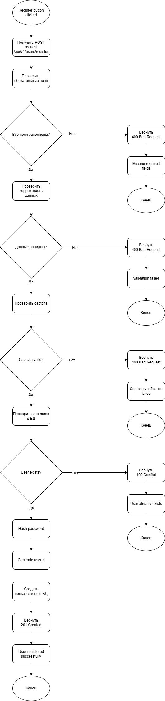

# Задача 3. REST API регистрации пользователя

## Описание

Функциональность предназначена для регистрации нового пользователя в системе Book Store.

При нажатии на кнопку **Register** фронтенд отправляет запрос на backend-сервис.  
Backend выполняет валидацию входных данных, проверяет reCAPTCHA, проверяет уникальность username и создаёт пользователя в базе данных.

---

## 3.1 REST API

### Метод

```http
POST /api/v1/users/register
### Входные параметры

| Параметр | Тип | Обязательный | Ограничения |
|-----------|-----|---------------|--------------|
| firstName | string | Да | От 2 до 50 символов, только буквы |
| lastName | string | Да | От 2 до 50 символов, только буквы |
| username | string | Да | От 4 до 30 символов, должен быть уникальным |
| password | string | Да | Минимум 8 символов, минимум 1 заглавная буква, 1 строчная, 1 цифра, 1 спецсимвол |
| captchaToken | string | Да | Валидный Google reCAPTCHA token |

### Пример запроса

```json
{
  "firstName": "Ivan",
  "lastName": "Ivanov",
  "username": "ivan",
  "password": "Password123!",
  "captchaToken": "03AFcWeA7..."
}
```
### Успешный ответ

**HTTP status:** `201 Created`

| Параметр | Тип | Обязательный | Описание |
|-----------|-----|---------------|----------|
| userId | string | Да | Уникальный идентификатор созданного пользователя |
| username | string | Да | Логин пользователя |
| firstName | string | Да | Имя пользователя |
| lastName | string | Да | Фамилия пользователя |
| status | string | Да | Статус пользователя |
| createdAt | string | Да | Дата и время создания пользователя в формате ISO 8601 |

### Пример успешного ответа

**HTTP status:** `201 Created`

```json
{
  "userId": "8f3a1c2e-1b7a-4e4a-9c4e-7e9a12345678",
  "message": "User registered successfully",
  "status": "SUCCESS"
}
```
### Ответы с ошибкой

| HTTP Code | Ошибка | Сообщение |
|------------|---------|------------|
| 400 Bad Request | Validation Error | Некорректные входные данные |
| 409 Conflict | User Already Exists | Пользователь уже существует |
| 401 Unauthorized | Invalid Captcha | Captcha verification failed |
| 500 Internal Server Error | Server Error | Internal server error |

---

### Формат ответа с ошибкой

| Параметр | Тип | Обязательный | Описание |
|-----------|-----|---------------|-----------|
| code | string | Да | Код ошибки |
| message | string | Да | Описание ошибки |
| details | array[string] | Нет | Список ошибок валидации |

---

### Пример ответа — слабый пароль

**HTTP status:** `400 Bad Request`

```json
{
  "code": "VALIDATION_ERROR",
  "message": "Validation failed",
  "details": [
    "Password must contain at least one uppercase letter",
    "Password must contain at least one digit",
    "Password must contain at least one special character",
    "Password length must be at least 8 characters"
  ]
}
```

---

### Пример ответа — пользователь уже существует

**HTTP status:** `409 Conflict`

```json
{
  "code": "USER_ALREADY_EXISTS",
  "message": "User already exists"
}
```

---

### Пример ответа — captcha не пройдена

**HTTP status:** `400 Bad Request`

```json
{
  "code": "INVALID_CAPTCHA",
  "message": "Please verify captcha to register"
}
```

---

### Пример ответа — ошибка сервера

**HTTP status:** `500 Internal Server Error`

```json
{
  "code": "INTERNAL_SERVER_ERROR",
  "message": "Unexpected server error"
}
```
---

## 3.2 Алгоритм создания пользователя на backend

1. Backend получает POST-запрос `/api/v1/users/register`.
2. Проверяет, что тело запроса передано в формате JSON.
3. Проверяет наличие обязательных полей:
   - firstName;
   - lastName;
   - username;
   - password;
   - captchaToken.
4. Проверяет корректность `firstName` и `lastName`:
   - поле не пустое;
   - длина от 2 до 50 символов;
   - содержит только буквы.
5. Проверяет корректность `username`:
   - поле не пустое;
   - длина от 4 до 30 символов;
   - содержит допустимые символы.
6. Проверяет пароль:
   - минимум 8 символов;
   - минимум 1 заглавная буква;
   - минимум 1 строчная буква;
   - минимум 1 цифра;
   - минимум 1 специальный символ.
7. Проверяет `captchaToken` через сервис reCAPTCHA.
8. Если captcha не пройдена, backend возвращает `400 Bad Request`.
9. Проверяет, существует ли пользователь с таким `username` в БД.
10. Если пользователь уже существует, backend возвращает `409 Conflict`.
11. Хэширует пароль.
12. Создаёт нового пользователя в БД.
13. Присваивает пользователю уникальный `userId`.
14. Возвращает успешный ответ `201 Created`.
### Ключевые проверки backend

| Проверка | Ошибка |
|----------|--------|
| Не передано обязательное поле | 400 Bad Request |
| Некорректный формат имени или фамилии | 400 Bad Request |
| Слабый пароль | 400 Bad Request |
| Captcha не пройдена | 400 Bad Request |
| Username уже существует | 409 Conflict |
| Ошибка сервера или БД | 500 Internal Server Error |
## Диаграмма backend-алгоритма

